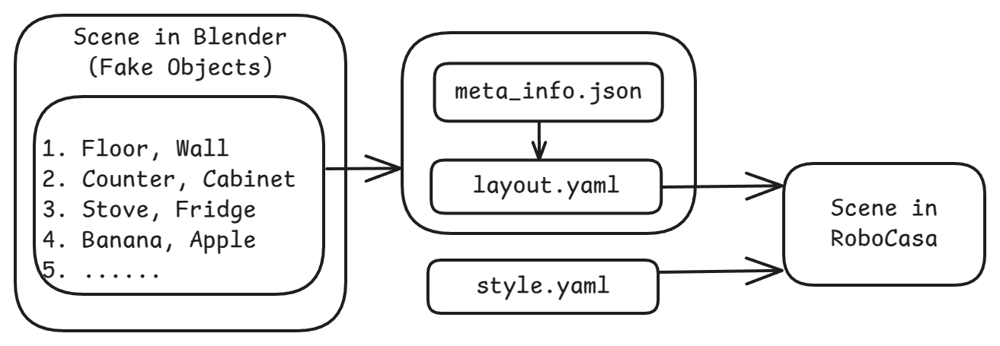
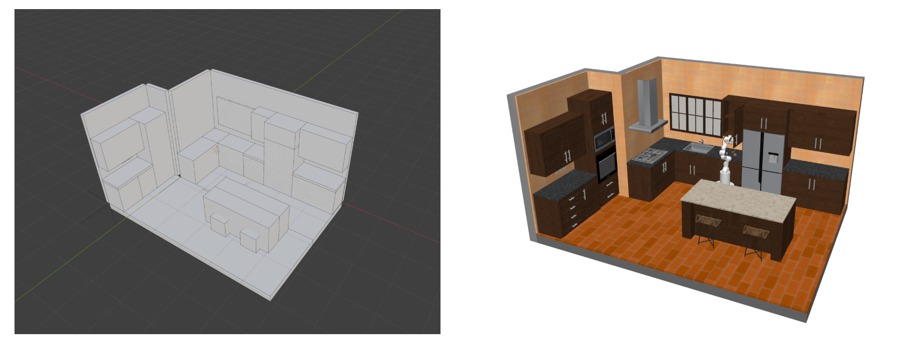

# Blend2Floorplan

A blender add-on which models and converts the kitchen scene from blender to RoboCasa `yaml` format.

## Example

<!--  -->

## Development

Some tips for development in IDE:

- `ln -s blend2floorplan ~/.config/blender/4.3/scripts/addons/blend2floorplan` to enable the plugin in Blender.
- `pip install fake-bpy-module` to enable type hinting in IDE like VSCode and Cursor.

And make sure you have the `robocasa` conda environment installed.

## Usages

Three panels in the Blender UI:

- `Spawn`: Spawn objects and scenes.
- `Export`: Export the room objects to `json` file, and then convert to `yaml` file.
- `Check`: Check the yaml scene in robocasa.

## TODO

- [ ] `Spawn Objects`
  - [x] walls, floors
  - [ ] other fixtures
- [x] `Check Objects`
- [x] `Export YAML`
  - [x] `export_to_json`
  - [x] `json_to_yaml`
